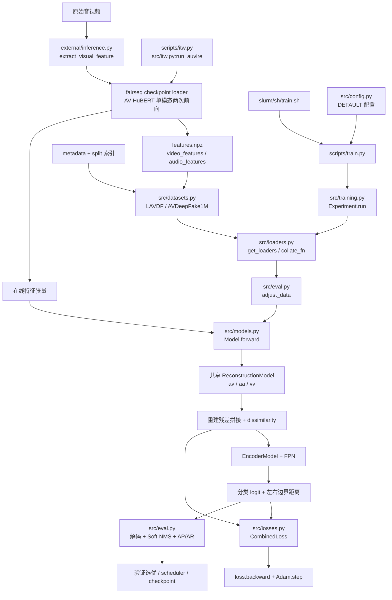

# AuViRe 项目系统分析与创新路线

审查日期：2026-09-08。工作目录：`E:/Project/auvire-main`。Git HEAD：`06633d5`。

**核心结论：这是“离线 AV-HuBERT 表征 + 可训练的共享重建器 + 残差时序定位器”的项目。默认 AuViRe 主体是 CNN，不是端到端微调 AV-HuBERT 的 Transformer。开展算法实验前，应首先修正 AP、检测分数、数据有效长度和入口错误。**

本报告依据实际源码调用链、Git 记录、官方源码哈希比对和合成张量最小复现撰写。未启动真实训练、未读取任何数据集或模型权重，也未验证原论文数值。行号对应本次审查时的源文件；本次未修改业务源码。

审查边界严格采用当前工作区 `.gitignore`，不是 HEAD 中的旧版本。先读取根规则，再用 `git ls-files --cached --others --exclude-standard` 与 `git check-ignore --no-index` 交叉过滤，以排除“已经跟踪但现在命中忽略规则”的文件。可审查集合内没有子目录 `.gitignore`；初始集合为 584 个文件，其中 30 个 Python 文件。`results/` 未被忽略，但其中 JSON 是既有结果，不是本次复现实验，未将其数值当作运行证据。

以下内容全部跳过：`ckpt/`、任意层级名为 `fairseq/` 的目录、`运行日志_AVHuBERT_全量/`、`运行状态_AVHuBERT_全量/`、`auvire_lavdf_avhubert_npz_v2_bundle/`、`AuViRe_LAVDF_NPZ_v2_完整文件/`、规则中列出的 ZIP 和 `auvire_lavdf_avhubert_npz_v2.sh`。没有进入这些目录，也没有通过 Git 历史或远程副本绕过限制。关于它们，只讨论未忽略源码中的引用及接口要求。

配套证据：

- [项目官方源码对照.json](./项目官方源码对照.json)：全部 30 个 Python 文件及 `requirements.txt` 的官方 blob SHA。
- [项目审查最小复现.py](./项目审查最小复现.py)：仅装载允许源码中的定义，使用合成张量，不访问 NPZ、checkpoint、fairseq。
- [项目审查验证结果.json](./项目审查验证结果.json)：实际输出、异常、参数和梯度检查结果。

核心源码跳转：[Dataset](E:/Project/auvire-main/src/datasets.py:55)、[DataLoader](E:/Project/auvire-main/src/loaders.py:32)、[Model.forward](E:/Project/auvire-main/src/models.py:976)、[关系残差融合](E:/Project/auvire-main/src/models.py:937)、[CombinedLoss](E:/Project/auvire-main/src/losses.py:161)、[backward/optimizer](E:/Project/auvire-main/src/training.py:257)、[验证](E:/Project/auvire-main/src/eval.py:70)、[AP计算](E:/Project/auvire-main/src/metrics.py:82)、[离线提取](E:/Project/auvire-main/external/inference.py:129)、[在线推理](E:/Project/auvire-main/src/itw.py:959)。

## 1. 项目总体架构

项目有三条业务路径，应分开理解：

1. **数据集离线特征提取**：`external/inference.py` 在 AV-HuBERT 的运行环境中处理原始视频，生成两个单模态特征数组。
2. **AuViRe 训练与基准评估**：`scripts/train.py / test.py / predict.py` 读取特征；训练阶段不加载 AV-HuBERT，不经过 fairseq Trainer。
3. **真实视频与扰动评估**：`scripts/itw.py / robustness.py` 在线加载 AV-HuBERT 提取特征，再调用已训练 AuViRe；不是训练流程。



图中的两条特征路径是替代关系：离线训练使用 NPZ，在线推理可直接使用特征张量。`external/inference.py` 的外部导入环境与 `src/avhubert` 的包导入环境也不完全相同，详见第 4 节。

任务主体是 **temporal forgery localization（TFL）**：每个时间位置预测真假分数和伪造区间左右距离。视频级 deepfake detection（DFD）由时间分数聚合获得；当前主模型没有音频真假、视频真假各自独立的输出头。

## 2. 各目录和核心文件作用

### 2.1 根目录与核心代码

| 路径 | 作用 | 实际依赖/调用方 |
|---|---|---|
| `README.md` | 环境、数据、提取、训练、评估操作说明 | 用于核对操作意图，结论以实现为准 |
| `requirements.txt` | Python 依赖；PyTorch 系列由 README 另行安装 | 提取、训练、ITW 环境共用，耦合较重 |
| `LICENSE` | 项目许可 | AV-HuBERT 文件还保留 Facebook 原版权声明 |
| `auvire-architecture.jpg` | 原项目架构插图 | 非执行代码，本报告调用图依据源码重建 |
| `src/config.py:5,30,56` | 两套 Python 字典默认配置、`load_default` | 训练入口使用；不是 Hydra 驱动的 AuViRe 训练 |
| `src/datasets.py:8,75` | `LAVDF`、`AVDeepFake1M`：索引、NPZ、截断补零、帧标签 | `get_dataset` → `get_loaders` |
| `src/loaders.py:16,32` | `collate_fn`、随机数初始化、DataLoader 构建 | 训练、验证、测试 |
| `src/models.py:840` | `Model`：共享重建、残差融合、编码、FPN、任务头 | `Experiment.get_model` 和独立预测脚本 |
| `src/losses.py:88` | `CombinedLoss`：定位、检测、重建损失 | `Experiment.get_criterion`；训练及 TFL 验证 |
| `src/training.py:128` | `Experiment`：训练编排、优化、调度、选优、保存、测试 | `scripts/train.py`、消融及部分推理模型构建 |
| `src/eval.py:39` | `Evaluation`：评估前向、累积预测、区间解码、指标 | 训练每轮验证、训练结束测试、`scripts/test.py` |
| `src/post_process.py:15` | `soft_nms_torch_parallel` | 基准评估、预测提交、ITW |
| `src/metrics.py:43,135` | 项目自实现 TFL `AP`、`AR` | `Evaluation.compute_tfl_metrics` |
| `src/logger.py:33` | JSON `Logger` | 保存配置、训练历史、测试结果；不是 checkpoint 类 |
| `src/seed.py:7` | Python/NumPy/Torch/CUDA 确定性设置 | 每个训练 seed 开始时调用 |
| `src/itw.py:959` | `run_auvire`：视频分段、人脸/嘴部、语音有效性、在线特征、区间与视频汇总 | `scripts/itw.py` → `store_results` |
| `src/robustness.py:365` | 视频/音频预处理和 AV-HuBERT 在线提取 | 扰动脚本；其中若干工具也被 ITW 复用 |
| `src/speechbrain_utils.py:7` | 读取并归一化语言识别音频 | ITW 的 SpeechBrain 语言识别；不参与 AuViRe loss |

### 2.2 入口与辅助目录

| 路径 | 入口/用途 | 关键关系 |
|---|---|---|
| `external/inference.py:129,175` | `extract_visual_feature`、`save_data` | 原始媒体 → AV-HuBERT → NPZ；需要外部 `preparation.align_mouth` 等 |
| `scripts/train.py:15` | 选择数据集，默认配置 → `Experiment.run()` | Slurm 的 `train.sh` 实际执行这里 |
| `scripts/test.py:50` | 两个训练来源 × 两个评估数据集 × TFL/DFD | 从 checkpoint 配套 JSON 读取架构，不调用 `load_default` |
| `scripts/predict.py:16,141` | AVDeepFake1M 真正隐藏测试集预测 | 专用 Dataset；输出 DFD TXT、TFL JSON/JSONL |
| `scripts/ablation.py:14,63` | loss、关系组合、运算、backbone、Transformer 消融 | 读取已有 JSON 的 `config`，逐项替换再训练 |
| `scripts/robustness.py:490` | 无扰动、音频扰动、视频扰动、backbone 相似度实验 | `src/robustness.extract_visual_feature` + AuViRe |
| `scripts/itw.py:25,39` | CSV/下载报告中的视频 → ITW 结果 JSON | 默认 `device="cpu"`；不是 GUI 或 Web 服务 |
| `scripts/results.py:24,54` | 网格结果汇总、论文表格、扰动和现实视频结果分析 | 读取既有结果，不是新的训练入口 |
| `slurm/sh/*.sh` | 集群资源、环境变量、任务分发 | `train/test/predict/ablation` 对应同名脚本；各 robustness shell 对应扰动模式；real-world 脚本对应下载/ITW |
| `real-world-data/download.py:9,171` | yt-dlp 下载、ffprobe 音视频流检查、URL→文件名报告 | 为 ITW 准备输入 |
| `real-world-data/itw_details.csv`、`urls` | 现实视频清单/标注/来源引用 | 不是模型训练代码；本次不验证样本内容与标签正确性 |
| `results/ablation,grid,test,robustness,itw,...` | 版本库内已有实验产物 | 不应混淆为实时生成的结果；脚本可能因其存在而跳过计算 |

当前允许范围内不存在根级 `train.py`、根级 `train.sh`、独立 `fusion.py` 或 YAML 实验配置。融合实际在 `src/models.py`；数据加载不由 AV-HuBERT 的 Dataset 承担。

### 2.3 AV-HuBERT 集成代码

| 文件 | 类/功能 | 在当前调用链中的角色 |
|---|---|---|
| `src/avhubert/hubert.py:291,644` | 注册 `AVHubertModel`；`extract_finetune` 提取表征 | 在线特征提取核心；依赖 fairseq 的基类、TransformerEncoder、注册机制 |
| `src/avhubert/resnet.py:131` | `ResEncoder` | 视觉前端，3D 卷积及逐帧 ResNet 表征 |
| `src/avhubert/hubert_pretraining.py:159` | `AVHubertPretrainingTask` | fairseq task 注册、checkpoint 配置/模型构建所需 |
| `src/avhubert/hubert_dataset.py:136` | `AVHubertDataset` | AV-HuBERT 的原始音视频/标签管线；不是 AuViRe NPZ Dataset |
| `src/avhubert/utils.py` | 归一化、裁剪、mask 工具 | 被 AV-HuBERT 集成层使用 |
| `src/avhubert/decoder.py` | `TransformerDecoder` | 语音序列解码基础组件，不是 AuViRe 定位头 |
| `src/avhubert/sequence_generator.py` | `SequenceGenerator` 等 | 语音序列生成支持；本项目定位 forward 不进行文本 beam search |

### 2.4 配置如何关联

训练：`load_default(dataset)` → `Experiment.__init__` 展开配置 → `get_model/get_criterion/get_optimizer/get_scheduler/get_loaders`。LAVDF 默认重建下/上采样各 3 层、编码 retain/downsample 各 2 层；AVDeepFake1M 默认分别为 1/1、1/1。其余主设置相似：长度 512、维数 128、窗口 15、关系 `av/aa/vv`、Adam 1e-3。

保存：`Logger` 将完整 `cfg` 写入 JSON；`.pth` 仅保存模型与 optimizer state。评估/推理：读取硬编码路径的 JSON 中 `config` 再构建模型，随后读取相应 `.pth`。修改 `src/config.py` 不会自动改变这条推理配置路径。

AV-HuBERT：`saved_cfg`/`task.cfg` 来自其 checkpoint，决定图像 crop/mean/std、特征维度等；与 `src/config.py` 不属于同一层配置。实际 checkpoint 被跳过，因此无法核验下载的权重是否与代码的 768 维假设一致。

配置中的 `optimization.optimizer.params`、`scheduler.params` 目前未被消费；`load_default` 返回原字典而不是深拷贝；`update` 才会深拷贝。`get_cfgs` 是每次单项变更，不是多个参数的笛卡尔积网格。

## 3. 完整数据流

### 3.1 原始视频到 NPZ：以允许查看的提取脚本为准

入口为 `external/inference.py` 的顶层参数解析和数据集分支，核心函数为 `extract_visual_feature(video_path, ckpt_path)`，行 129。

```text
MP4 文件
 ├─ load_audio（61）
 │    librosa.load(sr=16000, duration=24.0)，默认单声道
 │    → logfbank，float32
 │    → 相邻 4 个声学帧堆叠（末尾不足补零）
 │    → 对每个时间步特征向量做 layer_norm
 │    → [1, F_audio, T_audio] CUDA Tensor
 │
 └─ preprocess_video（91）
      cv2 解码，最多 600 帧
      → 10 个线程执行 dlib 人脸/68 点检测
      → landmarks_interpolate
      → 基于稳定点对齐 256×256、嘴部点 48:68、96×96 ROI
      → 灰度
      → /255、按 task.cfg 中心裁剪、按 mean/std 归一化
      → [1, 1, T_video, H_crop, W_crop] CUDA Tensor
             ↓
      裁掉较长模态的尾部，T=min(T_audio,T_video)
             ↓
      fairseq.checkpoint_utils.load_model_ensemble_and_task
             ↓
      model.eval() + torch.no_grad()
       ├─ extract_finetune(audio=audio, video=None) → A [1,T,D]
       └─ extract_finetune(audio=None, video=frames) → V [1,T,D]
             ↓
      squeeze(0) → CPU NumPy
             ↓
      save_data（175）：np.savez(.../features.npz)
       ├─ audio_features: [T,D]
       └─ video_features: [T,D]
```

这里**没有必须先生成 WAV 文件**的中间步骤，`librosa` 直接从输入路径读取音频。默认声学库参数通常得到 26 维 log-filterbank，4 帧堆叠后 104 维；严格接口应与 checkpoint 的 `audio_feat_dim` 核对，不能从未读取的实际权重推定。

提取不是把音频视频同时输入一次，再随意拆分融合向量。源码明确执行 **audio-only 与 video-only 两次 AV-HuBERT 前向**。在线集成实现 `src/avhubert/hubert.py:655` 对缺失模态创建零特征，再执行 checkpoint 配置要求的 concat/add、归一化/投影、共享 Transformer，输出对应单模态条件下的语音表征。

提取脚本只保存两个数组，没有保存标签、有效长度、fps、采样时间戳、提取器版本或 checkpoint hash。用户提到的 v2 NPZ 工具包及脚本已忽略，**不能推断其 schema、对齐方式、原子写入或是否修复了上述行为**；报告描述的是当前可追踪脚本。

### 3.2 NPZ 到 Dataset：还有一条独立标签链

`LAVDF.__init__:13` 把 `val` 改为 `dev`；扫描 `data/LAV-DF_emb/<split>`，从 `metadata.min.json` 建立 `(feature_path, video_target, audio_target, fake_periods)` 索引，缓存到 `utils/lavdf_<split>.json`。选 AV-HuBERT 时，在 `__getitem__:62` 才把路径中的 `_emb` 替换为 `_emb_avhubert` 并移除 `mediapipe/`。

因此，仅有新的 `_emb_avhubert` 特征树并不一定够：如果缓存不存在，初始化仍依赖旧 `_emb` 目录和元数据。这是当前代码与独立 NPZ 交付包之间必须核对的接口缺口。

`AVDeepFake1M` 的索引还保存视觉、音频、联合 fake segments，但 `__getitem__:166` 最终只返回联合区间生成的标签，丢弃模态级监督信息。

两个 Dataset 的实际返回均为：

```text
V: [512,768]（代码期望；读取时未校验）
A: [512,768]
Y: [512,3]
fake_periods: 秒单位的原始区间列表
```

令 `t=min(T_video,T_audio,512)`：两模态只取前 `t` 步，末尾补零。**没有把 `t` 返回调用方。** NPZ array 的 dtype 被继承，没有统一转 `float32`。

`period2target` 将 `[s,e]` 秒转换为 `[int(25s),int(25e)]` 帧，代码使用闭区间；区间内第 i 帧标签为 `[1, i-start, end-i]`，其他位置为 `[0,0,0]`。例如 `[1.0,2.0]` 对应索引 25…50，共 26 个正位置；这需要与数据集标注的端点约定统一。

### 3.3 一个样本进入 AuViRe

假定单个正常输入片段有 250 个时间步。Dataset 补为 512；以默认 LAVDF 配置、batch 大小 B 为例：

| 阶段 | 张量 | 文件/位置 |
|---|---|---|
| `collate_fn` | V/A `[B,512,768]`，Y `[B,512,3]`；GT 列表另存 | `src/loaders.py:16` |
| `adjust_data` | V/A/Y 移到训练 device | `src/eval.py:9` |
| `get_model_inputs` | V/A → `[B,768,512]` | `src/models.py:934` |
| 重建器 pre projection | 768→128，长度 512 | `CNNDownUpCrossModalReconstructionModel:448` |
| 重建 downsample | 长度 512→256→128→64，通道 128 | 同上 `encoder` |
| 重建 upsample | 64→128→256→512 | 同上 `decoder` |
| 重建 post projection | 128→768，得到 `R(A)` 或 `R(V)` | 同上 `projection_post` |
| 关系残差 | `R(A)-V`、`R(A)-A`、`R(V)-V`，各 `[B,768,512]` | `Model.get_reconstruction_pairs:937` |
| 残差拼接 | `[B,2304,512]` | `get_encoder_inputs:968` |
| CNN Encoder/FPN | 4 层输出 `[B,128,512]`、`[B,128,512]`、`[B,128,256]`、`[B,128,128]` | `CNNEncoderModel:649` |
| 分类/回归头 | 每尺度 `[B,T_l,3]` = `[logit,left,right]` | `Model.forward:992` |
| 重建误差支路 | `dissimilarity [B,512]` | `get_reconstruction_pairs:950` |

注意，两个长度 512 的 FPN 层来自不同深度，不是数据重复。因子列表是 `[1,1,2,4]`；默认 AVDeepFake1M 则为 `[1,2]`。

### 3.4 输出、loss 和更新

训练时直接使用 logits 和左右距离，不先做 Soft-NMS。定位标签来自同一 NPZ 样本对应的元数据。

```text
各尺度 logits/offsets + Y + dissimilarity
  → CombinedLoss.forward
  → scalar loss
  → loss.backward()
  → 所有实际参与计算的 AuViRe 参数累积梯度
  → Adam.step()
```

评估时才做 sigmoid、区间解码 `[i-left,i+right]`、Soft-NMS，并换算为秒后与原始区间比较。网络学习的 offset 始终是**原始 25fps 帧坐标单位**，不是各层特征格点数；因此当前 loss 没除 factor、解码没乘 factor 是配套设计，不能孤立判为尺度 bug。

## 4. AV-HuBERT / fairseq / AuViRe 关系

### 4.1 三者的职责

| 对象 | 是什么 | 特征提取阶段 | AuViRe NPZ 训练阶段 |
|---|---|---|---|
| AV-HuBERT | 预训练音视频语音表征模型 | 将音频与嘴部序列分别映射到表征 | 不构造、不 forward、不加入 optimizer |
| fairseq | 模型/task 注册、配置、checkpoint 和神经网络基础组件框架 | 加载 AV-HuBERT，提供 TransformerEncoder 等 | 主训练依赖链没有导入它；不负责训练循环 |
| AuViRe `Model` | 重建表征并利用残差定位伪造的任务模型 | 离线提取脚本不调用它 | 从 NPZ 特征训练重建器、编码器、FPN、分类/回归头 |

**AV-HuBERT 是否冻结？** 两层含义必须区分：

- 提取函数显式 `eval()` + `no_grad()`，没有该阶段优化器，不更新 AV-HuBERT；这是推理式冻结。
- AuViRe 训练时更彻底：AV-HuBERT 根本不在 `Model` 中，NPZ 序列化也已切断计算图。无需在 AuViRe 参数上写 `requires_grad=False` 才算冻结。

`extract_finetune` 是函数名，不能据此认定进行了 fine-tuning。是否反向传播取决于调用上下文；当前调用上下文是 no-grad。

### 4.2 多个 fairseq 的实际证据与未知边界

`.gitignore:5` 的 `fairseq/` 没有根锚定，既匹配根目录，也匹配 `av_hubert-main/fairseq/`。本次仅通过规则匹配确认它们均被排除，**未确认这两个物理目录是否同时存在，未检查内容、版本、补丁、内部 `.gitignore` 或实际导入路径**。这是遵守用户范围约束，不是认定二者相同。

未忽略源码中的全部直接 fairseq 导入集中于：

| 调用文件 | 位置/导入 | 导入链 |
|---|---|---|
| `external/inference.py` | 12、134，`import fairseq`、checkpoint loader | 外部提取入口 → 外部 AV-HuBERT 注册代码 → fairseq |
| `src/robustness.py` | 8、9、373 | 扰动/ITW 工具 → `src.avhubert` → fairseq |
| `src/itw.py` | 17、21、426 | 在线媒体推理 → `src.avhubert` → fairseq |
| `src/avhubert/hubert.py` | 16–25 | 模型注册、基类、wav2vec2 Transformer、GradMultiply/LayerNorm |
| `src/avhubert/hubert_pretraining.py` | 15–19，308 | task/data/字典/生成支持 |
| `src/avhubert/hubert_dataset.py` | 18–19 | FairseqDataset 和 data_utils |
| `src/avhubert/decoder.py` | 19–35 | fairseq 解码器/模块 |
| `src/avhubert/sequence_generator.py` | 13–17 | fairseq 搜索与增量解码 |

这些代码都导入顶层包名 `fairseq`，**没有写成“AuViRe 专用 fairseq”和“AV-HuBERT 专用 fairseq”两个包名**。同一 Python 进程通常由 `sys.path` 顺序决定先找到哪一份，之后 `sys.modules` 缓存它；目录名不会自动建立用途隔离。

根 README 26–34 的安装步骤是克隆 AV-HuBERT、初始化其 submodule、复制 `fairseq` 到 AuViRe 再 editable install。这解释了为何操作后可能有两份源码副本，但不能证明今天两份仍相同。README 49–52 则把 `external/inference.py` 复制进 AV-HuBERT 目录运行，其 `import hubert`/`utils` 应解析到那个外部目录，而不是自动解析到本仓库 `src/avhubert`。

**是否需要两个？** 从允许源码的接口需求看不需要两个不同包，所需的是“可用且兼容 AV-HuBERT 的 fairseq”。若两个环境确需不同历史依赖，则保留两个隔离环境可以合理；不能将其解释为 AuViRe 核心训练必须用第二份 fairseq。

**能否统一/删除？** 理论上可以统一到一个已验证兼容的安装，但当前不能作删除决定：

- 删除 editable install 指向的源码，会使在线提取/推理导入失败。
- 删除 `PYTHONPATH` 指定的副本，会改变 import 解析或暴露另一个不兼容版本。
- 若目录完全未被任何环境引用，其删除通常不影响 NPZ 训练；这一前提尚未验证。
- 后续在允许审查该依赖时，应记录每个环境的 `fairseq.__file__`、editable 来源、commit/patch、AV-HuBERT checkpoint 加载冒烟结果，再决定。**本次未执行这些可能导入被忽略代码的检查。**

### 4.3 官方/后续修改如何区分

本地 Git 是 2026-09-02 的导入和 README 合并历史，不能据此恢复原作者逐文件开发历史。但通过 GitHub connector 获取 [官方 AuViRe](https://github.com/mever-team/auvire) 对应文件内容及 blob SHA 后，计算本地 UTF-8/LF 规范化的 Git blob hash：**30/30 Python 文件及 requirements.txt 全部一致**。本地工作区原先只有 `.gitignore`、`README.md` 的未提交修改。

因此本报告涉及的线程化 dlib、`src/itw.py`、DistilBERT 可选分支等都已经存在于当前官方代码，不能因注释多、风格不同、文件较长就称作本项目后加功能。`src/avhubert` 是官方 AuViRe 携带的 AV-HuBERT 集成代码，保留第三方版权；与 AV-HuBERT 原仓库的逐行差分不是本次已完成证据。被忽略工具包中的后续修改完全不在结论范围内。

## 5. 训练 forward/backward 调用链

### 5.1 精确调用顺序

```text
slurm/sh/train.sh:21 / 24
  → python scripts/train.py -d ...
scripts/train.py:15
  → load_default(dataset)
  → Experiment(cfg, folder="ckpt", job_info=False)
  → Experiment.run()                              src/training.py:330
      → Logger / check_complete
      → 对未完成的每个 seed：
          seed_everything                        src/seed.py:7
          get_loaders                            src/loaders.py:32
          get_model → Model.__init__             training.py:177 / models.py:842
          model.to(device)
          get_optimizer → Adam(model.parameters())       training.py:213
          get_scheduler                                  training.py:203
          get_criterion → CombinedLoss                   training.py:195
          training_process                               training.py:289
            → train_one_epoch                            training.py:243
                model.train()
                对每个 batch：
                  adjust_data                            eval.py:9
                  model([video,audio])                    training.py:253
                    → nn.Module.__call__
                    → Model.forward                      models.py:976
                      get_model_inputs
                      get_reconstruction_pairs
                        → ReconstructionModel.forward    models.py:595
                        → CNNDownUp...forward            models.py:513
                      get_encoder_inputs
                      EncoderModel.forward               models.py:751
                        → CNNEncoderModel.forward        models.py:691
                        → torchvision FPN
                      HeadModel.forward × 2              models.py:836
                      拼为各尺度 [logit,left,right]
                  optimizer.zero_grad()                  training.py:254
                  criterion(p, labels, z)                training.py:255
                    → CombinedLoss.forward               losses.py:161
                  loss_.backward()                       training.py:257
                  optimizer.step()                       training.py:258
                  compute_metric（仅用于训练日志）         training.py:219
                → Evaluation(val).compute_metrics        training.py:262
                → scheduler.step                         training.py:279
            → 写训练日志、按验证分数存最佳模型              training.py:298 / 306
            → 训练结束加载最佳模型                        training.py:312
            → Evaluation(test).compute_metrics
```

这里描述的是代码意图及可到达调用链；完整默认入口当前受第 7 节的 `self.job` 错误影响，不能把这幅图误解为已成功跑完真实训练。

### 5.2 共享重建器如何学习

记输入特征为 A/V，共享网络参数为 θ。默认三组配对：

```text
av: input=A, target=V, prediction=Rθ(A)
aa: input=A, target=A, prediction=Rθ(A)
vv: input=V, target=V, prediction=Rθ(V)
```

只有一个 `self.reconstruction_model`（`models.py:880`），没有三个独立模型，也没有关系 token。默认 CNN 不启用 Dropout，`av` 与 `aa` 两次调用的输出相同，复现已经验证。两种 target 不同，因此它们的 residual 和梯度目标仍不同。

分类定位梯度可以穿过 residual 的减法回传到 Rθ。`abs` 误差也向 Rθ 提供重建约束（差为零处采用框架规定的次梯度）。固定 A/V 不需要梯度；对它们 `.detach()` 并不能重新连接 AV-HuBERT，也不是训练所缺少的操作。

### 5.3 loss 的实际组成

在 `CombinedLoss.localization_loss:132`，对尺度 l：

```text
Y_l = Y[:, ::factor[l], :]
N_pos = max(该样本该尺度正帧数量, 1)
L_loc,l = sum_t [λ_focal * focal(logit, y)
                 + λ_diou * y * DIoU(offset, target_offset)
                 + λ_sl1 * y * smoothL1(offset/25, target_offset/25)] / N_pos
L_loc = 对尺度求均值
```

DIoU 公式由 `ctr_diou_loss_1d:6` 实现，输入左右距离非负；offset target `[i-start,end-i]` 与同中心区间表示匹配。Focal 调用 torchvision 的 sigmoid focal loss，输入是 logits，**这里没有多做 sigmoid**。

视频级 `L_det`（146）使用 `sum(logit*softmax(4*logit))` 聚合各尺度帧 logits，再做 BCEWithLogits。目标为该样本是否有任何伪造帧。默认配置不启用它。

`L_rec`（156）先以 `any(Y_fake)` 判定整条样本：**只要一帧是假，整个样本所有时间点的重建损失均置零**。只有完全真实的视频接受平均重建误差监督，且包含 padding 区域。

默认 composition 为 `[focal,diou,rec]`，最终是：

```text
L = mean_batch((L_loc + L_rec) / 2)
```

不是 MSE、不是 AV-HuBERT 的掩码预测 loss，也不是三个独立 audio/video/fusion 分类 loss。所有权重目前为 0/1 开关；改变 composition 会同时改变总损失分母，消融时还应关注有效梯度尺度。

### 5.4 哪些参数参与训练

| 模块 | 注册/优化状态 | 梯度来源 |
|---|---|---|
| 共享重建器的投影、卷积/反卷积、LayerNorm | 是 `Model` 子模块，加入 Adam | 定位残差路径 + 真实视频重建损失 |
| 时序 Encoder | 加入 Adam | 分类、定位；可选检测损失 |
| torchvision FPN | 作为 `self.pyramid` 注册，加入 Adam | 各尺度任务头 |
| 各尺度 classification head | `ModuleList` 注册，加入 Adam | Focal；可选 DFD loss |
| 各尺度 regression head | `ModuleList` 注册，加入 Adam | 正帧 DIoU/SL1 |
| Transformer 可选分支的 attention/FFN/pos embedding | 选中时加入 Adam | 与对应 CNN 替换位置相同 |
| DistilBERT 可选重建分支 | 选中时未显式冻结，加入 Adam | 重建和定位；不属于默认路径 |
| AV-HuBERT、dlib、MediaPipe、SpeechBrain | 不在 NPZ 训练模型内 | 无 AuViRe 训练梯度 |
| NPZ 输入与标签 | 非 Parameter | 不优化 |

对默认 LAVDF 模型，在合成 B=2、T=512、D=768 输入上实际验证：**12,101,516 个参数；所有参数张量的 `.grad` 均非 None，梯度有限；Adam 更新后首个参数变化。** 这支持“没有明显模块漏注册/漏入 optimizer”，不代表每层每步都有非零梯度：本次 `regression.model.2` 的所有参数梯度为零，属于需要调查的 ReLU/监督有效性问题，详见第 9 节。

### 5.5 optimizer、scheduler、模式与 AMP

Adam 在 `run:363` 创建，参数取完整 `self.model.parameters()`；当前无参数分组、weight decay 配置传递或 freeze/unfreeze 计划。`zero_grad` 在 forward 之后、backward 之前，语义正确；移到 forward 前可更早释放上一批梯度。

默认 ReduceLROnPlateau 在每轮验证后工作，mode 为 max，patience=`训练patience-3`。分数是全部 `vap` 和 `var` 指标之和，既非训练 loss，也非单一 AP@0.5。StepLR 和拼写为 `cosineanealing` 的选项也存在。

训练每轮 `.train()`；`Evaluation.get_predictions:71` 调 `.eval()` 并包裹 `torch.no_grad()`；下一轮会恢复 `.train()`。默认 CNN 没有 BatchNorm，主要是 LayerNorm；`use_do=False` 使 CNN 中配置的 main/head dropout 数值暂不生效。这是配置行为，不是遗漏了 `.train()`。

当前无 autocast、GradScaler、梯度累积或梯度裁剪。不能报告“AMP 使用错误”；准确说法是尚未启用 AMP。未来启用时，保留边界 IoU/归一化关键计算的 FP32，并检查无正样本和极短区间的有限性。

## 6. train / val / test 流程

### 6.1 数据划分与评估含义

| 请求 split | LAVDF 实际来源 | AVDeepFake1M 实际来源 |
|---|---|---|
| train | `_emb/train` 索引 → `_emb_avhubert/train` 特征 | `_emb/train`；默认 whole |
| val | `_emb/dev` → 相应 AV-HuBERT 特征 | `_emb/val` |
| test（get_loaders） | `_emb/test` → 相应 AV-HuBERT 特征 | **仍然 `_emb/val`** |
| 隐藏测试预测 | 无专门提交入口 | `scripts/predict.py` 的 `AVDeepFake1MTestSet` → `_emb_avhubert/test` |

AVDeepFake1M 的 val 与训练后 `test` 数据成员相同，这是源码确定的事实。README 81–85 也明确声明本地评估使用验证集。因此：

- 不能把 `training_process` 的 `test` 指标叫作“独立 AVDeepFake1M test 泛化成绩”；该验证集参与了早停/调度/选优。
- 不能反过来认定 train/val 样本一定重叠；源码没有这条证据。身份、源视频、真假衍生版本的泄漏需要元数据审计，本次未读取数据。
- 真正隐藏 test 有单独预测提交路径，不能将其与本地 val 指标混为一谈。
- 后续建议 train 内按身份/原始视频分组划分 internal-dev 做选优，冻结设置后再评估官方 val/test；准确命名全部报告。

DataLoader 当前所有 split 都 `shuffle=True`（独立隐藏 test 预测为 False），不会仅因此造成划分泄漏，但会影响 tied score 排序、批次组成和复现便利性。训练日志 AP 是按 batch 算 micro AP 后平均；验证 AP 是区间级指标，二者不应直接对比。

### 6.2 验证与基准测试

`Evaluation.compute_metrics:110`：前向并累计 → `transform_predictions:138` → Soft-NMS → TFL AP/AR 或 DFD accuracy/AP/AUC。

分类概率由 logit 一次 sigmoid；中心坐标由原始帧索引 `idx[::factor]` 取得；边界仅约束在 `[0,max_length]`。Soft-NMS 内部将帧变秒来计算宽度和抑制阈值，输出又乘回 fps，最终指标再除 fps。这一来回虽然可简化，**本身不是重复时间缩放错误**。

真正问题是缺少 sample 有效长度、DFD 再做 sigmoid，以及第 7 节中的 AP 积分实现。

### 6.3 checkpoint 保存与加载

保存位置在 `training.py:306`，内容为 `{"optimizer":...,"model":...}`。只在验证综合分数严格优于 `best_score=0` 时保存；结束后 `torch.load`，`model.load_state_dict(checkpoint["model"])`。默认严格加载，没有 `strict=False`。`scripts/test.py:90`、`predict.py:128` 同样默认严格加载；ITW 则额外指定 `map_location=device`。

此实现不等于完整断点续训：未保存 epoch、scheduler、RNG、best_score、配置副本；没有恢复 optimizer 的训练入口，`check_complete` 只按日志跳过已完成 seed，未完成 seed 从头开始。文件名也不含 seed、lr、完整数据版本，可能跨实验冲突。

默认 LAVDF `delete_ckpt=True`，训练完成后会删除最佳 `.pth`，而测试入口又需要它。应保留 best 与 last，明确何时归档。若所有验证分数为零/NaN，可能没保存任何新 checkpoint，结束时加载失败或误读同名旧文件。

没有读取实际 `.pth`，所以不能确认其 keys、架构、完整性或预训练资源是否匹配。本次检查的是保存/加载代码契约。

### 6.4 隐藏测试集预测

`AVDeepFake1MTestSet:19` 硬编码 343240 个编号路径。NPZ 失败时返回全零特征，仍给该 video_id 输出分数。`predict.py:141` 在 no-grad 中 forward，然后解码/Soft-NMS；DFD 写 `video_id;score`，TFL 写秒区间，最终 JSONL 合并成 JSON。

输出使用 append 模式；完整重跑会使 DFD TXT 出现重复 ID。TFL 最后合并到一个大字典，消耗较大内存，失败样本也没有单独清单。当前未提交任何预测到外部平台。

### 6.5 真实视频在线推理

```text
scripts/itw.py → store_results → run_auvire
  → get_model（JSON 配置 + AuViRe checkpoint）
  → SpeechBrain 语言识别器
  → ffprobe/媒体元数据 → get_offsets 分段
  → 每段音频 filterbank、视频帧（>25fps 时降采样）
  → MediaPipe LandmarksDetector → VideoProcess 嘴部 ROI
  → get_features：fairseq 加载 AV-HuBERT，两次单模态 no-grad 提取
  → 面部尺寸、可见讲话等规则筛选有效 frame_group
  → get_fake_periods → adjust_features → AuViRe → 解码/Soft-NMS
  → 加回段时间偏移
  → 汇总有效时长、疑似伪造区间、时间占比与 sweep-line 分数
```

在线管线使用 MediaPipe/自定义 `VideoProcess`，离线脚本使用 dlib/外部嘴部对齐，两者不是同一预处理实现。SpeechBrain 识别语言仅用于返回信息，没有语言分数进入 AuViRe 神经融合模块。ITW 的 score 是规则化时长指标，也不等价于 DFD 最大帧概率。

## 7. 项目代码问题清单

标记：**复现**=合成张量或隔离定义实际验证；**确定**=控制流可直接推出；**条件风险**=需要特定输入/环境，未确认真实数据触发率。P0 优先于任何正式新实验；P1 应在修复基线中处理；P2 属可维护性或特定分支改进。

### 7.1 P0：训练/评估可信度

| ID | 问题、证据位置 | 影响与建议 |
|---|---|---|
| P0-01 复现 | `src/metrics.py:82–97`，`AP.calculate_curve/calculate_ap` 缺少 recall=0 端点 | GT `[0,1]` 秒，最高分预测恰好命中时 AP 应为 1，当前为 0。遗漏最初召回区间面积，影响验证、选优、调度、TFL 报告。使用经官方评测对齐的 AP 算法；覆盖完美、全错、重复、并列分数、多 GT、空 GT 测试 |
| P0-02 复现/确定 | `eval.py:143` 已 sigmoid，`compute_dfd_metrics:88` 又 sigmoid；`predict.py:56,147` 相同 | 概率 0.01 变 0.5025、0.2 变 0.5498，正常有限正概率全部大于 0.5，DFD accuracy 退化为近似“全部判假”。删除第二次 sigmoid；单调变换理论上保留无并列情况下的 AP/AUC 排序，不能宣称所有指标同幅下降 |
| P0-03 复现/确定 | `scripts/train.py:16` 传 `job_info=False`；`training.py:131` 仅 True 时赋 `self.job`；300/372 无条件读取 | 在其他前置条件满足时，首轮日志处 AttributeError；ablation 同样受影响。构造函数初始化 `self.job={}`，再按需填充 |
| P0-04 确定 | `datasets.py:83–88` 把 test→val；同一验证集参与训练选择 | 本地名为 test 的 AVDeepFake1M 结果不独立。重命名为 val；独立 selection split 与隐藏 test 提交分开报告。不是已证明的 train/val 原始样本交叉 |
| P0-05 复现/确定 | `datasets.py:45–52,151–158` 标签未裁边界；`__getitem__` 裸 except；`loaders.py:16` | `[20,21]` 秒产生 index 512 越界；被吞掉后样本消失，可能系统性丢弃长 fake。全 None batch 再崩溃。统一窗口/标签/GT裁剪，错误明确记录并按 split/type 统计 |
| P0-06 确定 | `datasets.py:66–70,172–176` 不返回长度；loss、eval 都缺有效长度 mask | padding 被当真实帧参加 Focal/重建；可从 padding 区生成 proposal；短视频长度成为干扰特征。Dataset→collate→model→loss→metric→decode 全链路传 valid_mask/length |

AP 还存在协议风险：`metrics.py:120` 按 GT 顺序匹配候选，而非标准的按置信度遍历预测、匹配最佳未占用 GT；重叠多个 GT 时可能依赖 GT 顺序。`>threshold` 而非 `>=threshold`、整集合无正 GT 时除零等也需与目标 benchmark 对齐。不要只补一行 recall sentinel 后就宣称评估器已全面正确。

### 7.2 P1：模型、数据与推理

| ID | 问题、证据位置 | 影响与修复方向 |
|---|---|---|
| P1-01 复现 | `models.py:644`，Transformer FPN 使用无参数 `.squeeze()` | B=1 输出由 `[1,C,T]` 变 `[C,T]`，后续头/拼接失败；默认 CNN 的 `squeeze(dim=-1)` 正确。改为 `squeeze(-1)`，覆盖最后一个 batch |
| P1-02 确定 | `datasets.py:20–29,118–126` 按旧 backbone 树建索引；62/168 之后才替换路径 | 只有 AV-HuBERT 特征时可能空集或找不到 metadata。以 split manifest 和统一 feature_root 建索引，避免先依赖 Ma22 树 |
| P1-03 条件风险 | `datasets.py:27,124` 用 `split("/")` 拆 `os.path.dirname`；62/168 字符串替换 | Windows 路径中反斜杠导致元数据 key/mediapipe 替换错误。使用 pathlib relative path 与明确的 POSIX manifest key |
| P1-04 确定 | `datasets.py:35–40,92–97` 假定四种类别 counts 都存在 | 某类别缺失则越界，或 counts 顺序对应错误。用类别值→计数字典，缺类填零 |
| P1-05 条件风险 | `datasets.py:63–68,169–174`、`predict.py:34` 缺 dtype/shape/finite 检验 | float64、错维度、缺 key、NaN、空序列均可能进入训练或被静默跳过。`allow_pickle=False`，显式 float32/连续数组，校验 `[T,768]` 与长度；记录失败 |
| P1-06 复现 | `src/itw.py:454,477–478` CUDA 特征与 CPU `torch.zeros` 拼接 | 显式 device=cuda 时 RuntimeError。用 `features.new_zeros`；CLI 默认 CPU 不触发这一错误 |
| P1-07 确定 | `src/itw.py:466`、`scripts/robustness.py:278` 使用 Experiment 默认 `job_info=True` | 非 Slurm 运行会尝试 `scontrol show job None` 并失败。推理模型构建不应调用集群任务查询 |
| P1-08 确定 | `src/itw.py:794` AuViRe forward 未处于 no-grad；仅 get_model 调 eval | eval 不关闭 autograd，逐段生成不必要的计算图，Soft-NMS 又原地改写输出。用外层 inference_mode；不能仅据此认定持续显存泄漏 |
| P1-09 复现/确定 | `itw.py:678–683` 以 round(duration/20) 分段，`adjust_features:482` 截到512 | 29秒片段得到单个725帧窗口，模型只能看前512帧，后部可能仍计入有效时长。按模型窗长建立重叠滑窗，全时域覆盖并融合重叠预测 |
| P1-10 确定 | `itw.py:731` end_index 为包含式，791–792 切片却不加1 | 每个有效 frame_group 少最后一帧，与时间范围/统计不一致。统一半开区间 |
| P1-11 条件风险 | `external/inference.py:95–106,149` 不统一 fps；`itw.py:187,995` 只处理 fps>25 | 音频特征约25Hz，而24/15fps视频被按相同索引截尾，不是时间对齐，越往后偏移越明显。统一25Hz时间网格或按时间戳重采样 |
| P1-12 确定 | `src/avhubert/hubert_dataset.py:23–26`，DBG=True → 顶层 `import utils` | 从 `src.avhubert` 包导入时不会自然解析为同目录 utils；可能 ModuleNotFoundError 或绑定无关包。与 hubert_pretraining 的相对导入方式不一致；应包内相对导入。此缺陷继承自当前官方 AuViRe 集成 |
| P1-13 条件风险 | `models.py:23,64,278,415`，mask/positions 为普通 Tensor 属性 | `.to(new_device)` 不迁移非 buffer，Transformer 切设备可能出错，state_dict 不记录。注册 buffer 或 forward 按输入设备生成，处理 attn_mask 引用 |
| P1-14 确定 | `training.py:290,303,312`，只有分数>0才创建新 checkpoint | 全零/NaN 验证时无新 best；可能加载失败或旧文件。首个有效 epoch 必存，显式拒绝非有限分数，区分 run ID |
| P1-15 复现/确定 | `get_filename:20` 缺 lr/seed/数据版本；`check_complete/run:334` 只按日志完成判定 | 改 lr 仍得到同名文件；完整旧实验可能被跳过且 config 被覆盖，旧结果伪装成新配置。用规范化 config+data hash 和独立 run_id，已完成记录不可覆写 |
| P1-16 确定 | `config.py:9` 与 `training.py:326` 默认删除 LAVDF 最佳权重 | 刚训练完却不能供后续测试使用。默认保留 best/last，删除作为显式归档选项 |
| P1-17 确定 | `predict.py:41–42,151–156` 全零回退及 append | 坏 NPZ 被当有效样本输出无依据分数；重跑 TXT 重复。生成失败清单，输出到独立 run 目录，检查唯一 ID 和全量覆盖 |
| P1-18 复现 | `src/itw.py:764–770`，`valid_metadata` 遍历所有顶层key，包括errors列表 | 当音视频字段有效但errors非空时，将错误字符串当list索引而TypeError；错误收集机制反而触发崩溃。只校验audio/video字段，errors独立处理 |
| P1-19 确定 | `src/itw.py:388–395`，`LandmarksDetector.detect` | 每个人脸循环内重置max_id/max_size，且bbox是x/y/w/h却按w−x+h−y打分，不能可靠选最大脸。循环外初始化，按w×h比较；更稳妥是跨帧跟踪同一说话人 |
| P1-20 复现 | `src/itw.py:749–761`，`get_interval_union/get_total_length` | 秒区间以`begin-1`合并，额外填入≤1秒空隙；`[0,0.1]`和`[1,1.1]`总长应0.2秒却返回1.1秒，污染伪造/有效时长比例。精确union与允许间隙的平滑分开，单位参数显式化 |

### 7.3 P2：边缘配置、工具与实验操作

| ID | 位置 | 结论与建议 |
|---|---|---|
| P2-01 复现 | `logger.py:34–40`、`training.py:333` | logging=False 时没有 logger.path，但 run 必访问；解耦“落盘日志”与运行状态 |
| P2-02 确定 | `training.py:203–215` | optimizer/scheduler params 未传递；小 patience 产生负 scheduler patience，epochs<5 的 StepLR step_size 为0；未知 scheduler 隐式 None。校验配置并完整传参 |
| P2-03 条件风险 | `models.py:483,502,676` | max_length 要与下采样深度、奇数卷积核匹配；奇数长度实际 ceil 后与 LayerNorm 的 floor 长度不一致。构造时检查或显式 pad/crop；上下采样层数不等也可能错形状 |
| P2-04 确定 | `external/inference.py:217–219,258–260` | 1000分片使用 `N//1000+1`，末端索引可越界且索引在 try 外；N 可整除时也不正确。用范围分割/array_split，排序输入清单 |
| P2-05 确定 | `external/inference.py:232,274`、`scripts/robustness.py:319` | 裸 except 吞错误，可能还吞用户中断；结果集合随失败改变。记录异常类型/样本、定义可重试与不可恢复错误 |
| P2-06 确定 | `scripts/robustness.py:191–195,394–400` | reverb 写 `_reverb.wav`，预测却读取原 aud_out，所谓混响评估实际未用混响文件。返回实际输出路径并传递 |
| P2-07 确定 | `scripts/robustness.py:87–93` | `jpeg_compression` 实际是 resize 缩小再放大，没有 JPEG 编解码。重新命名为缩放退化，或实现指定 quality 的真实 JPEG |
| P2-08 条件风险 | `scripts/robustness.py:170–177` | SNR 直接作为线性功率比，若论文/图示按dB解释则不一致；应明确单位，dB需转换10^(snr/10) |
| P2-09 确定 | `real-world-data/download.py:181–190` | 每次重新生成随机文件名并覆盖 URL 映射；既有文件跳过机制难生效，也可能记录下载失败。复用旧 manifest，仅对新成功样本追加 |
| P2-10 复现/条件风险 | `post_process.py:26` | 只有1个proposal时循环不执行，返回 `[0,3]` 丢失batch维；当前正常模型候选很多，一般不触发。支持0/1/N；不同样本停止条件不应只看第0行 |
| P2-11 条件风险 | `post_process.py:11` | 零长度区间两两比较 union=0 得NaN；末端ReLU可生成0宽proposal。过滤零宽/无效区间或clamp分母 |
| P2-12 确定 | `scripts/results.py:69–75` | 表格按 `results[...]["test"]` 排超参；若用此排名决定配置，会产生测试集选模风险。源码能确认“按test排名”，不能确认作者实际如何选模 |

### 7.4 跨平台、环境与运行边界

`scripts/train.py/test.py/predict.py/ablation.py` 的训练/预测执行在模块顶层，缺 `if __name__ == "__main__"`。Windows spawn DataLoader workers=4 会重新导入主脚本，可能递归运行训练/初始化并触发 multiprocessing 启动错误；改为 `main()` 加入口保护。Linux fork 不能证明 Windows 安全。

多个脚本依赖 cwd、`$HOME/auvire`、`/usr/bin/ffmpeg`、Slurm 和硬编码 CUDA。用项目根路径解析、CLI/配置化路径、可选集群信息、统一 device。直接 `python scripts/train.py` 在未设置项目根 PYTHONPATH、也未安装包的干净环境可能找不到 `src`，应使用包入口或模块运行方式并明确环境。

本次实际 Python 3.10 环境有 Torch 2.6.0+cu124 / torchvision 0.21.0+cu124，CUDA可用，但缺少 transformers；README 目标为 Torch2.4.1/torchvision0.19.1。因此最小复现通过 AST 隔离与当前测试无关的顶层导入，**不是完整项目环境通过测试**。未安装/升级依赖。

`requirements.txt` 不包含外部脚本使用的 `skvideo`；外部提取又明确要求 AV-HuBERT 自己的环境，不能断言其外部环境必缺包。hydra/omegaconf 等历史依赖需要锁定兼容组合，未实际执行依赖解析，故不把未核实的版本冲突列为确定错误。Python/NumPy/PyTorch 升级风险也应以锁定版本烟测验证；没有检查被忽略 fairseq 中 README 所提 `np.float` 补丁是否已应用。

### 7.5 本次没有证据的问题

- AuViRe 默认训练不存在 `strict=False` 静默漏载；实际 checkpoint 是否完整未查。
- 参数注册使用 `ModuleList/Sequential` 和子模块属性，未发现“Python list 导致层未入 optimizer”。合成测试无 `.grad is None` 参数。
- 训练统计使用 `.item()`；评估存储 `.detach().cpu()` 且 no-grad，没有证据表明训练历史长期保留计算图。
- 评估 CPU 累积是明显增长的内存占用/复制成本，不能直接叫内存泄漏；未做长期 RSS/CUDA profiler。
- 未发现默认训练 `.train/.eval` 状态切换错误；ITW 缺的是 no-grad。
- 未确认数据实体/身份泄漏、实际 NPZ 损坏比例、实际dtype、实际fps、GPU峰值、所有分支运行情况。报告中的条件风险不等同于已经发生。
- Soft-NMS 的初始一维空 Tensor 与二维结果 `cat` 看似可疑，但当前 Torch 实际允许这种空张量拼接；没有把它误报为必崩 bug。

## 8. 性能与工程问题

### 8.1 主要计算与内存开销

1. **同一输入重复重建**：`Model.get_reconstruction_pairs:938` 默认调用 R(A) 两次、R(V) 一次。CNN 默认不启用 Dropout且无BN，R(A)可在单次forward缓存共享；只合并计算图中的同一个结果，梯度仍由两个用途相加。启用Dropout时两次调用原本采样不同，不能直接声称训练严格等价；eval下可安全复用。
2. **每视频/每段重载 AV-HuBERT**：`external/inference.py:134`、`src/robustness.py:373`、`src/itw.py:426` 都位于单样本函数内。应让提取器对象长期持有模型、transform、device；在线ITW还逐视频加载语言识别器、逐段创建人脸检测器。
3. **验证反复 cat 全历史预测**：`eval.py:129` 每batch扩展全部已存预测，导致累计复制量接近二次增长。用 batch list 最后一次cat，或分块后处理/流式保存。LAVDF默认4尺度每样本1408×3个float32约16.5KiB，10万样本仅原始预测约1.57GiB，未计排序、proposal、GT和复制峰值。
4. **固定512步对短样本浪费**：两个float32输入单样本约3MiB，B64约192MiB，仅输入不含标签/中间激活；workers预取和pin_memory增加主存占用。先修mask，再比较长度分桶与可变长度归一化；当前LayerNorm固定时间维，不能只改collate就宣称支持变长。
5. **逐batch CPU sklearn指标**：`training.py:219` 每尺度同步搬运labels/scores算AP；`adjust_data:18` 还为训练不用的视频target先从GPU拷回CPU。可只在必要任务计算target，训练AP降频或epoch集中计算。
6. **两次单模态AV-HuBERT大编码器前向**是方法定义的一部分；可缓存完全未变化模态，不可未经验证就改为一次联合前向并声称语义相同。扰动实验尤其经常重复算未扰动一侧。

训练样本从CPU送GPU是必要搬运；评估输出detach回CPU也有明确用途，不能一概删除。`pin_memory=True` 已有，但 `.to(device)` 未用 non_blocking，是否能提速应由profile确认。

### 8.2 NPZ与索引的完整性、I/O

- `torch.tensor(array)` 增加复制；可在显式float32与连续性校验后用 `torch.from_numpy`。`np.load` 用上下文管理器关闭压缩包/文件句柄，避免依赖析构时机。
- 每样本小NPZ反复打开造成I/O压力；先测DataLoader等待占比，再比较打包存储/分片、预取或本地缓存。不能仅因 `.npz` 扩展名就认定它经过压缩：当前使用 `np.savez`，不是 `savez_compressed`。
- 提取脚本只以“路径存在”跳过，损坏/部分写入文件会长期遗留。原子写入、schema验证、完成清单、checkpoint hash与提取版本属于工程改进。
- `utils/*.json` 缓存缺data_root/backbone/metadata版本键，多任务并发建索引可能竞态写同一文件；路径换了也会读旧缓存。
- 裸except丢样本，`showsize`统计的是索引数，不是实际加载成功数；必须保存成功/失败数和失败分布，否则指标样本分母不可信。
- 跳过生成目录是本次边界，所以这些建议针对可读writer/reader接口；不代表被忽略v2工具包没有实现它们。

### 8.3 可复现性与实验记录

已有 Python/NumPy/Torch/CUDA seeds、cuDNN确定性、worker seed，这是正确基础。但 `PYTHONHASHSEED` 进程内赋值不能回溯改变当前解释器哈希种子；`os.walk`不排序；DataLoader generator始终seed0且被三个split共享；不同split迭代可能影响后续随机状态。扰动脚本未统一设置所有NumPy/Torch随机源。

建议每个run保存：Git commit、完整配置及hash、数据manifest hash、split定义、提取配置、seed、环境lock、失败清单、代码修复版本、best/last checkpoint、scheduler/RNG。所有模型改动与修复基线采用同样seed/split/评估器，重复至少3个seed，报告均值和方差。

这些是可靠实验的条件与工程贡献，**不能作为论文的主要模型创新**。

## 9. 潜在算法问题

### 9.1 单一无条件重建器承担冲突目标

`R(A)`既要逼近V又要逼近A；没有指定目标模态。对单个坐标，真实样本包含 `|R(A)-V|+|R(A)-A|`，当A与V不相同时，中间一段输出可能同样最优，而不是唯一正确的跨模态预测。已有预训练表征可能对齐，因此该设计并非一定无效；但目标关系不可辨识是明确的研究切入点。

与此同时 residual 的差满足 `(R(A)-V)-(R(A)-A)=A-V`，定位编码器可以从两条残差中恢复直接音视频差异。这意味着收益可能部分来自直接模态差，而非“重建准确地建模真实分布”。后续应加 `A-V` / 原始A,V / 等参数投影残差对照，验证重建的独立作用。

### 9.2 未显式区分伪造差异和质量差异

残差直接拼接，`dissimilarity`直接求和（`models.py:950–972`）。编码器可以隐式学静态或内容相关融合，但没有显式模态置信度、缺失状态或关系权重。低照度、模糊、静音、天然延迟也可能产生大残差。创新应围绕“哪条关系在该时间可靠”，而不是简单再加一个attention标签。

### 9.3 真实帧监督利用不足

`reconstruction_loss`完全舍弃部分伪造视频中的真实时间段。把mask改为逐帧真值是低成本思路，但网络的时间感受野、跨时间LayerNorm，以及离线AV-HuBERT的上下文编码，可能把伪造内容传播到邻近甚至更远表征。不能简单宣称“只排除伪造帧就没有污染”；需要边界缓冲、可解释的上下文范围和消融。

### 9.4 边界有回归但没有专门过渡监督

已有多尺度FPN和左右距离回归，因此“新增多尺度/边界建模”不是从零开始的创新。欠缺的是独立start/end监督、残差变化与边界的关联、proposal质量分数和跨尺度一致性。粗尺度标签用简单抽样，短伪造段可能在某些尺度消失；所有尺度基本都覆盖所有持续时间，没有明确的尺度匹配策略。

### 9.5 回归头与重建输出的激活限制

`HeadModule:791` 用ReLU约束非负边界，其负半轴无梯度。本次默认CNN合成训练中第三个尺度回归分支（索引2）全部参数梯度为零，而非`.grad is None`。这说明需要记录正样本处的pre-activation、offset分布、各head非零梯度比例；不能由一次测试认定该层在真实训练中永久死亡。考虑softplus+小epsilon/合理bias初始化，单独作为修复/稳定性消融。

重建post projection也默认经过ReLU（`Projection`复用`ConvBlock`），只输出非负值；若AV-HuBERT真实特征含负值，该部分不可被准确重建。未读取实际特征，故需将输出线性化作为诊断对照，统计目标负值比例，不能预先宣称一定改善精度。

### 9.6 长度、归一化与损失权重

`LayerNorm([C,T])`跨时间求统计并学习逐位置affine参数，固定长度且受padding比例影响，含一定全局信息；不要把当前CNN称为绝对局部模型。真实样本无正帧时，Focal分母为1，而fake样本按正帧数归一化，不同长度/真假视频的相对权重会显著不同。关系数增加时`L_rec`因误差求和也变大，模态组合消融夹杂了loss scale变化。

同理，`AutoRegressiveTransformerEncoderCrossModalReconstructionModel`虽然有方向性attention mask，前后projection仍包含非因果卷积与跨时间LayerNorm；不能仅凭类名就声称整条模型支持严格因果流式推理。它是当前可选结构，不属于默认CNN。

### 9.7 模态级标签尚未用好

AVDeepFake1M索引已经保留`visual_fake_segments/audio_fake_segments`，但Dataset只输出联合GT。LAVDF则保存修改标志与联合区间，能否推导独立模态区间取决于原标注语义；不能无条件把联合段复制到两个模态作为真值。现有输出无法单独解释“音频假/视频假/都假”，可作为后续多任务扩展。

## 10. 当前已有创新分析

| 层次 | 当前能力 | 归属判断 |
|---|---|---|
| AuViRe方法贡献 | 跨/同模态语音表征重建，利用残差而非仅原始特征做伪造定位；真实视频重建正则与定位联合学习 | 已有AuViRe方法，不是本地新增；本地实现`models.py:937–995`、`losses.py:156`直接支持 |
| AuViRe实现与实验设计 | 关系组合、共享重建器、残差操作、CNN/Transformer对照、FPN、DFD/TFL与扰动/现实视频管线 | 已存在官方代码，不能重新命名为自己的创新 |
| 第三方模型能力 | AV-HuBERT语音表征，ResNet/Transformer，DistilBERT可选分支，SpeechBrain语言识别 | 第三方能力；使用本身不构成创新 |
| 第三方框架能力 | fairseq注册/加载/模块，torchvision FPN/focal，PyTorch反向传播与Adam | 基础依赖 |
| 当前本地可证明新增算法 | 未发现：30个Python文件全部与所核对官方版本相同 | 忽略目录里的任何工作不在判断范围内 |
| 后续工程优化 | 修AP、修分数、mask、原子写入、提取器复用、并发、I/O、日志/断点 | 复现质量与工程成果，不冒充主要算法贡献 |

AuViRe论文将音视频语音表征重建产生的差异用于时序伪造定位，这一贡献归属已有作者，见[原论文](https://arxiv.org/abs/2511.18993)。本报告的细节分析依据本地源码；不以摘要中的提升幅度证明当前代码评估正确。

已有研究也已涉及边界、跨模态同步和融合：[HBMNet](https://arxiv.org/abs/2508.02000)讨论层级边界、多尺度和模态融合；[BA-TFD](https://arxiv.org/abs/2204.06228)已有边界匹配、帧分类与对比约束；[ICCV 2025跨/同模态同步工作](https://www.openaccess.thecvf.com/content/ICCV2025/papers/Anshul_Intra-modal_and_Cross-modal_Synchronization_for_Audio-visual_Deepfake_Detection_and_Temporal_ICCV_2025_paper.pdf)也研究同步关系。因此下面候选是**针对当前代码的研究假设**，不是已通过全面文献排重的“首次提出”。

## 11. 可新增创新点候选

以下方案均以前述修复后的同一基线为对照。默认保留离线AV-HuBERT输入，不读取原始媒体也能完成前3项主要训练实验。需要真实音视频扰动做外推验证时，才额外重提取测试特征。预期收益为定性研究预期，未声称具体AP提升数值。

### A1：可靠性引导的时变关系残差门控（Top 1）

**问题与区别。** 当前 `av/aa/vv` 残差直接拼接，重建误差直接求和。卷积能学融合，但没有明确质量变量或随时间输出的关系权重；伪造与模糊、失声等退化可能都表现为大残差。目标是保持AuViRe残差定位结构，显式学习每条关系在每个时间的可用性。

**修改位置。** `src/models.py:937 get_reconstruction_pairs` 保留分关系残差；`968 get_encoder_inputs` 插入门控；`Model.__init__:880–908` 注册轻量gate；`src/losses.py:161` 接受可选可靠性辅助项；`src/config.py` 增加gate开关/温度/权重；`src/training.py:255` 传辅助输出。有效长度从datasets/loaders/eval一并传入。

**具体实现。** 令每条关系残差 `E_r ∈ R^(B×768×T)`。用共享1×1投影/小时间卷积从 `E_r`、残差幅度、相邻差分以及A/V内容摘要预测 `q_r(t)`，沿**关系维**softmax：

```text
w_r(t) = softmax_r(q_r(t)/τ)
E_fuse = concat_r(3 * w_r(t) * E_r(t))
```

初始化gate最后层为0，使w=1/3，新增模型初始输入与原3关系拼接等价；factor=3在关系数变化时用R替换，避免把改变幅值误当门控收益。保持 `[B,2304,T]` 与原Encoder兼容。

第一轮只对定位输入门控，**不要同时用w压低L_rec**，否则网络可能简单把困难关系权重降到0来逃避重建。不能直接令“残差越小置信度越高”，那会把真正伪造证据抑制掉。可靠性与伪造得分应分开：可在训练特征上对单模态注入已知局部噪声/遮挡，监督受影响关系的可靠性，并用原始样本定位标签训练真假。特征扰动只作低成本初筛，不等同于真实媒体压缩。

对缺失模态，显式mask其依赖关系，例如audio缺失时禁用av/aa，保留vv；所有关系均不可用时返回无效区段而非softmax全负无穷。可选温和的关系利用率约束防止全程只选一路，但不要求每个样本必须平均使用。

**为什么可能有效。** 单模态受损时仍保留可用证据；局部失真不再以固定幅值支配整个2304通道表示。能直接观察权重与退化/伪造位置的关系。

**实验与消融。** 同分割比较固定拼接、可学习全局常数权重、每视频权重、逐帧权重；分别加入/去掉可靠性监督、内容特征、误差差分、防塌缩约束；加等参数普通Conv对照。报告干净TFL AP/AR、DFD AUC/AP、真实视频误报、音频/视频单独退化及缺失模态、各伪造类型结果。权重可视化仅作分析，不能替代指标。

**难度/收益/论文价值。** 低至中，主要在`get_encoder_inputs`附近，保留现有NPZ和任务头，易关闭回退；预期更偏鲁棒性与泛化而非保证干净集涨分。单独“加gate”论文价值有限；“区分质量残差与伪造残差的可靠性学习”加扎实跨退化验证才有明确价值。主要风险是gate把异常证据当噪声，因此必须保留无门控对照与伪造类别分层评估。

### A2：关系条件化的共享重建器（Top 2）

**问题与区别。** 当前R(A)对av/aa输出完全相同，缺少目标模态条件。新方案仍共享大部分网络，但使 `R(A,av)` 与 `R(A,aa)` 可表达不同映射，而不是三个完全独立大网络。

**修改位置。** `src/models.py:521 ReconstructionModel`、`448 CNNDownUpCrossModalReconstructionModel` 的瓶颈/decoder输入；`Model.get_reconstruction_pairs:937` 传relation_id；`src/config.py:21` 附加condition模式/adapter rank。第一轮保持`src/losses.py`原重建选样策略，避免混杂；`training.py`一般只需透传配置。

**具体实现。** 共享pre projection+encoder得到H(A)/H(V)，在瓶颈加入小关系embedding生成FiLM：

```text
H_r = (1 + γ_r) ⊙ H_input + β_r
prediction_r = shared_decoder(H_r)
```

γ/β按通道广播，初始为0，复用原权重。也可采用目标模态共享小adapter，或末端两个输出投影，但首轮只选一种，避免扩大搜索。允许缓存同输入H，减少无意义重复编码；adapter注册为ModuleDict/Parameter，确保加入Adam。重建损失按关系数归一化，作为单独消融检查原求和尺度影响。

**为什么可能有效。** 把“输入来自哪一模态、需要重建哪一模态”显式输入任务，使共享编码器学习可迁移结构、小adapter处理映射差异，减少同一输出要同时逼近A/V的冲突。反面风险是重建过强后fake也被轻易重建，降低残差判别性；保持容量有限并观测真假误差分离。

**实验与消融。** 原共享网络；共享+扩大同等参数量；输入模态条件；目标模态条件；完整关系条件；完全独立重建器；adapter宽度/rank；仅L_loc与L_loc+L_rec。必须加入`A−V`、原始A/V特征及等容量直接投影定位器，检验收益是否真的来自关系重建。报告每关系真实/伪造误差、audio-only/video-only/both fake分层、跨数据集TFL与模型参数/吞吐。

**难度/收益/论文价值。** 中，forward接口略改但无需重提特征；可零初始化从原重建器起步。预期提高关系可辨识性和残差区分能力。研究论点比泛泛增加层数更清楚；须证明原共享设计的目标冲突确实制约性能，不能只展示条件embedding存在。

### A3：残差过渡引导的多尺度边界辅助学习（Top 3）

**问题与区别。** 现有FPN+offset回归能定位区间，却没有显式建模残差从真实到伪造、从伪造到真实的过渡；粗尺度抽样对极短片段不稳定。新贡献应是“重建残差过渡与边界的一致建模”，不是声称首次使用FPN或边界头。

**修改位置。** `src/models.py:989` 的多尺度features、`HeadModel/HeadModule:755–837`旁新增边界头；`get_encoder_inputs`产生误差差分；`src/datasets.py:45,151 period2target`或专用标签函数生成start/end监督；`src/losses.py:132,161`新增边界loss；`src/eval.py:138`及`predict.py:51`按需做边界得分融合，不能只改一个解码入口。

**具体实现。** 对各关系误差计算有效邻接位置的时间差分 `ΔE(t)=E(t)-E(t-1)`，投影后以小残差分支并入最高分辨率定位特征。新增两通道start/end logits，在GT边界附近生成受mask约束的窄高斯/软标签（宽度以秒定义并映射到尺度）。主offset头保留，加入 `λ_b L_boundary`。初始先只在训练中辅助，不改变推理分数；验证稳定后再用边界概率重打分proposal或小范围refine。所有尺度先映射回原始帧坐标，禁止把跨尺度格点距离直接相加。

**为什么可能有效。** 边界监督约束模型关注“哪里发生变化”，与持续区间内真假分类互补，可能改善短伪造段和高IoU阈值精度。轻量误差差分提供针对AuViRe结构的输入，而非增加通用复杂backbone。

**实验与消融。** 无新增头；只有boundary head；仅ΔE分支；二者一起；使用原始A/V差分替代重建差分；单尺度/多尺度边界监督；soft label宽度；仅aux训练/额外推理refine；等参数卷积对照。核心指标AP@0.75/0.95、起止绝对误差（秒）、按伪造时长分桶召回；不能只报告AP@0.5。额外quality/IoU head可作为后续子实验，不在首轮同时叠加。

**难度/收益/论文价值。** 中，新增小头但要认真处理标签端点/尺度/后处理。预期收益集中于边界精度和短片段，干净视频误报也可能因过度强调变化而增加。已有HBMNet/BA-TFD等边界研究，需明确与它们区别是重建残差过渡的监督与一致性，而非简单“有start/end头”。

### B1：有上下文保护的逐帧真实区域重建正则

**问题与修改。** 当前部分fake视频所有时间步的L_rec为0，浪费真实区域。修改 `src/losses.py:156 reconstruction_loss`，`datasets.py`提供valid_mask，`config.py`提供边界保护半径/权重；必要时`models.py`暴露逐关系误差而非先求和。

**实现。** 用 `safe_real = valid & ~dilate(fake_mask, margin)`，仅在safe_real归一化误差；保留完全真实样本原约束，逐步引入部分fake中的安全区域并warmup权重。没有safe_real时返回与计算图相容的0，不做0除。先使用固定GT区域而不是预测pseudo label，避免模型自主把难点排掉。因为AV-HuBERT上下文可能跨越很远，dilation不保证表征完全未污染；必要时只把此项作为弱正则。

**有效性与原法区别。** 从视频级选样改为带边界保护的时间级选样，利用更多真实时间片；局部fake训练数据比例高时可能更有价值。

**验证/消融。** 视频级原策略、无保护逐帧策略、多个margin、warmup与固定权重、仅完全真实样本数量匹配对照；记录safe_real覆盖率、真假误差差距、边界AP和跨数据集表现。区分数据利用增加与总loss尺度变化。

**难度/收益/论文价值。** 低至中，几乎不增加推理成本，预期改善重建监督数据效率；上下文污染可能导致反效果。单独改mask难以支撑强论文，可作为A2的辅助机制，经消融验证后再组合。优先级B，而非因改动少就保证低风险收益。

### B2：保留原始不一致证据的局部时延交互

**问题与修改。** 当前只对齐长度，不区分正常AV时延与伪造不一致。修改 `models.py:934–984`，在A/V投影后新增有限时延相关/局部cross-attention；配置lag范围；`losses.py`可加可控合成偏移的lag辅助监督。无需改变现有NPZ的字段，但需要有效时间mask。

**实现。** 计算 `C(t,δ)=cos(P_A A_t,P_V V_(t+δ))`，δ限定小范围，softmax得到软对齐/时延分布。并行保留未对齐残差E、对齐后残差E_align、lag与其熵；通过小残差adapter交给现有Encoder，而不是直接替换掉原残差。合成延迟只对可信真实训练样本施加，label不随单模态时间平移错误复制。

**有效性与原法区别。** 显式把正常时间偏移与内容不可预测性分开，可在带延迟真实视频上降误报。若只强制对齐，可能把真实的伪造不同步证据消掉，所以必须保留原支路。

**验证/消融。** 未对齐、硬对齐、软对齐；是否保留原残差；lag窗口；lag监督；delay-only真实样本与真正局部fake分开；自然与合成延迟、跨语言/说话速度（有合法分组元数据时）分层。报告延迟估计误差、真实误报、fake召回和算力。

**难度/收益/论文价值。** 中至高，局部相关比全局cross-attention可控，预期偏跨域鲁棒性。风险是“校正掉伪造”；同步已有强相关工作，需围绕保留不一致的双支路设计做差异性论证。优先级B偏后。

### B3：模态级辅助定位与联合一致性

**问题与修改。** `AVDeepFake1M.__getitem__:166–176` 丢弃已有audio/visual fake segments。修改Dataset/collate/adjust_data保留两个模态标签及可用标志；`models.py`基于aa/vv残差新增音频/视频辅助头；`losses.py`增加对应loss及联合一致性；`config.py`加开关和权重。

**实现。** 两个辅助头预测 `p_a(t),p_v(t)`，联合目标来自原fake_segments；可以软OR `1-(1-p_a)(1-p_v)` 与主头做弱一致性，不把这个表达式当真实独立概率定律。主输出仍由跨模态残差定位，辅助任务不替代它。没有可靠独立模态标签的样本/数据集用label-availability mask跳过相关loss，不复制联合GT制造伪标签。

**有效性与原法区别。** 把被闲置的模态标注转化为表示约束，降低模型只依赖单一强信号的机会，输出更容易定位错误来源。联合fake与各模态标注时间边界若不一致，需要先做标签协议检查。

**验证/消融。** 仅audio aux、仅video aux、双aux、再加一致性；独立头/共享头；不确定标签跳过；只在AVDeepFake1M训练与跨LAVDF迁移比较。报告模态级AP、联合AP、audio-only/video-only/both类召回，分析负迁移。

**难度/收益/论文价值。** 中；主要成本是标签接口改造，模型增量小。预期改善单模态伪造识别与解释性；多任务和一致性本身已常见，论文价值需来自关系残差如何对应模态伪造及跨数据集可迁移机制。优先级B。

### C1：AV-HuBERT参数高效联合适配

**问题与修改。** 冻结语音表征可能忽略伪造需要的细粒度痕迹，但当前NPZ已经丢失原始计算图。真正适配需新增原始媒体Dataset/训练提取器，将 `src/avhubert/hubert.py` 模型加入联合nn.Module；重写 `datasets/loaders/training/config`，并针对允许审查的fairseq版本进行兼容验证。

**实现。** 固定绝大部分AV-HuBERT，仅开放顶层adapter/LoRA或少数层，独立小学习率参数组，保留AuViRe定位loss并加表征蒸馏约束防漂移；按照视频时间窗同时训练A/V前向。仅在NPZ之后加adapter可以低成本做，但它是特征适配，不能称AV-HuBERT联合微调。

**有效性与原法区别。** 从语音预训练空间向伪造定位任务自适应，可能捕获缓存表征未保留的线索；原方法整个AuViRe训练不更新backbone。

**验证/消融。** 冻结、NPZ后adapter、顶层adapter、少层解冻；有无蒸馏；参数组lr；从相同backbone开始，控制数据增强和计算预算；报告跨域性能、遗忘、显存、速度及特征重提成本。

**难度/收益/论文价值。** 高；需要原始数据与未忽略依赖审查范围变化，破坏现有廉价NPZ训练优势。潜在收益不确定、过拟合和表征漂移风险较高；“用了LoRA”不是创新。优先级C，不作为当前第一阶段。

## 12. 创新点优先级

| 等级 | 推荐顺序 | 方向 | 工程改动/算法风险 | 首要收益假设 | 推荐理由 |
|---|---:|---|---|---|---|
| A：优先做 | 1 | A1 时变关系残差门控 | 小至中/中 | 单模态退化与跨域稳健性 | 保持NPZ和Encoder接口，可从等价初始化开始 |
| A：优先做 | 2 | A2 关系条件化共享重建器 | 中/中 | 残差可辨识性、缓解映射冲突 | 问题有当前代码和数学结构直接证据 |
| A：优先做 | 3 | A3 残差过渡边界辅助学习 | 中/中 | 高IoU定位、短fake召回 | 与项目TFL任务最直接对应，可先仅aux不改解码 |
| B：可以做 | 4 | B1 安全真实帧重建正则 | 小/中 | 数据效率、弱监督覆盖 | 成本低，须验证上下文污染，适合A2辅助 |
| B：可以做 | 5 | B3 模态级辅助定位 | 中/中 | 单模态fake与解释性 | 已有模态标注但要保持语义准确 |
| B：可以做 | 6 | B2 保留不一致的时延交互 | 中至大/中至高 | 延迟真实视频误报 | 容易对齐掉伪造线索，需专门测试集 |
| C：风险较高 | 7 | C1 AV-HuBERT联合适配 | 大/高 | 表征任务适配 | 原始数据/算力/依赖成本高，当前缓存流程不支持 |

“A级”表示**相对当前结构最可控、最值得先验证**，不代表保证涨点。纯gate、边界头、FiLM、辅助loss本身都是已有机制；创新必须落在针对伪造定位的具体建模假设和证据上。

## 13. Top 3 推荐创新点

### Top 1：可靠性引导的时变关系残差门控

最适合先做，因为现有三种残差天然就是三个可加权的信息来源，能在 `get_encoder_inputs` 附近局部实现，保留768维特征与2304通道Encoder入口。等价初始化可减少训练扰动，恒等/常数/逐帧门控对照清楚。优先目标是鲁棒性而非只追求单数据集涨点。

**首轮最小版本：** 逐帧3关系gate，均匀初始化，原loss不变，仅在valid时间计算；验证成功后再单独加退化可靠性监督。

### Top 2：关系条件化的共享重建器

现有代码已经验证 `R(A,av)==R(A,aa)`，这是比“想加一个模块”更扎实的问题起点。小条件adapter既保留原方法共享学习优势，又允许不同目标模态输出不同。它最适合构成论文的方法动机与结构贡献。

**首轮最小版本：** 共享编码器/解码器瓶颈加3个relation条件的FiLM，零初始化，对照等参数无条件模型，保留原样本级重建loss。

### Top 3：残差过渡引导的多尺度边界辅助学习

当前最终任务是TFL，只有分类与offset回归会使边界精度的研究空间被忽略。轻量start/end监督直接对应AP@0.95和短伪造段，可在不重提AV-HuBERT的条件下实施。但必须承认已有边界研究，突出AuViRe重建误差的过渡结构。

**首轮最小版本：** 最高分辨率FPN特征增加Δresidual分支与start/end辅助头，只加训练loss，先不改Soft-NMS或原始分数，避免混杂。

这三项可组合为“可靠关系 → 关系可辨识重建 → 精细时序边界”的完整研究路线，但应**分别验证再组合**。如果时间仅够一个方向，先做A1；如果更重论文动机的明确性，A2可以先于A1开展。不要第一版同时改backbone、loss、融合和后处理。

## 14. 推荐的后续代码修改路线

### 阶段0：建立可信评估与可运行基线

先修改 `src/metrics.py`、`src/eval.py`、`scripts/predict.py`：修AP积分/匹配、单次sigmoid和0/1候选边界；与官方评测器对齐。把旧metric结果标明旧实现，修复后重新算固定预测的指标。**修评估带来的分数变化不能写作算法提升。**

再修改 `src/training.py`、`src/logger.py`、`scripts/train.py/ablation.py`：修job/logging、main保护、完整配置传递、独立run ID、best/last和恢复状态，默认保留权重。独立推理构造模型不查询Slurm。把NPZ root、metadata root、device、checkpoint path变为配置。

验收：标准AP极端样例与第三方评测一致；DFD概率范围与阈值正确；普通非Slurm命令能完成小规模训练/保存/重新加载；同样输入加载前后输出一致；不同lr/seed/data版本不覆盖实验。

### 阶段1：修正样本有效长度与时间协议

依次修改 `datasets.py → loaders.py → eval.adjust_data → models.py → losses.py → eval/predict/itw解码`。

- 定义样本字典：`video_features, audio_features, lengths/valid_mask, labels, segments, sample_id`；模态级标签后续可选。
- 以统一25Hz或时间戳映射为协议，明确区间端点；窗口裁剪时同步平移/裁剪标签与评价GT，长视频采用全覆盖滑窗。
- loss只在有效帧计算；Transformer传key_padding_mask；CNN避免补零经bias/归一化产生信号后回流。由于`LayerNorm([C,T])`包含padding，考虑通道LayerNorm或显式masked normalization。**这一归一化变化影响模型本身，应作为独立基线版本和消融，不悄悄并入新gate收益。**
- 丢失NPZ和错shape显式报错/建失败清单，校验读取前后的样本数；不把全零回退计为正常预测。

验收：长度1/短样本/512/超长、B1/最后batch、无fake/单fake/多fake/全fake、末尾fake、audio-video长度不一致、无有效区间、CPU/GPU、float64/NaN/坏NPZ等边界行为明确；split成员及源视频组不交叉。

### 阶段2：只做工程等价优化并冻结实验基线

缓存默认确定性R(A)、复用AV-HuBERT提取器、消除逐batch全历史cat、统一schema和writer状态。测试优化前后eval输出一致；Dropout模式分别处理。记录样本吞吐、GPU峰值、CPU RSS、提取时延与加载等待占比，不能把工程加速当算法增益。

选定无测试泄漏的开发划分；原官方代码、修复基线、各新增方法分别命名。修复基线至少跑3个seed，保留预测用于重算metrics。当前不必一开始重提全部AV-HuBERT特征；先确认允许使用的NPZ符合输入协议。

### 阶段3：单模块模型实验

| 实验ID | 改动 | 保持一致 | 最重要观测 |
|---|---|---|---|
| B0 | 修复基线 | 数据/特征/评估协议 | 基线均值、方差、失败率 |
| G0 | 固定/常数gate控制组 | backbone、loss、Encoder尺寸 | 参数/幅值变化是否已解释收益 |
| G1 | A1逐帧gate | 同上 | clean与退化表现、权重是否塌缩 |
| G2 | G1+可靠性监督 | 新增训练增强必须另设对照 | 质量/伪造是否被混淆 |
| R1 | A2关系条件化 | 原L_rec策略 | av/aa输出分化、真假残差分离 |
| R0 | 等参数无条件/直接A−V对照 | 同参数预算与训练设置 | 排除纯容量/直接模态差贡献 |
| T1 | A3边界辅助 | 原解码不变 | 边界误差、高IoU、短fake召回 |
| L1 | B1逐帧真实正则 | 原重建架构 | safe_real覆盖、邻域污染 |

所有实验应在一套固定开发协议下选超参，不重复试探最终test。鲁棒性按相同视频集合计算并报告无效/失败率；不能每种扰动剔除不同难样本后只比较AP。

### 阶段4：组合与论文证据

先选稳定的G1/G2、R1、T1，做单项、两两、三项组合；预算允许时完成3因素8组合。统一参数/FLOPs/时延报告、多个seed、跨LAVDF与AVDeepFake1M评估；高IoU与短片段指标作为边界方案主证据，退化和缺失模态作为可靠性方案主证据，关系误差分布与直接差分对照作为条件化方案主证据。

失败案例按音频假/视频假/都假、长短fake、自然不同步、嘴部遮挡、无讲话区间分类，查看是否用低置信度拒绝全部困难样本换取漂亮指标。最终论文只把通过消融与独立评估验证的机制写成贡献；未验证方向保留为假设。

### 本次验证的范围与交付状态

30个原始Python文件均通过AST语法解析。默认LAVDF CNN的B2完整forward/loss/backward/Adam与B1 forward通过；实际复现AP错误、DFD二次sigmoid、标签越界、空collate、Transformer B1维度丢失、日志属性问题、配置命名碰撞、ITW GPU padding错误、metadata错误列表处理错误、时长union填入空隙，以及29秒窗口超过模型覆盖范围。单proposal Soft-NMS返回错误空形状而非抛异常，结果文件如实记录。

验证脚本以AST装载允许源码的原始函数/类定义，绕过与当前检查无关的第三方顶层导入和入口副作用；没有修改被测函数体。当前缺transformers、目标依赖版本与已安装环境不同，因此这些验证不代表完整环境安装、AV-HuBERT提取、真实NPZ读取、全部Transformer/DistilBERT分支、整轮训练或外部benchmark提交已经通过。

本次只新增本报告及三份中文审查证据文件，未修业务源码、未读取忽略目录、未删除任何fairseq、未改动用户原有README/.gitignore修改。
